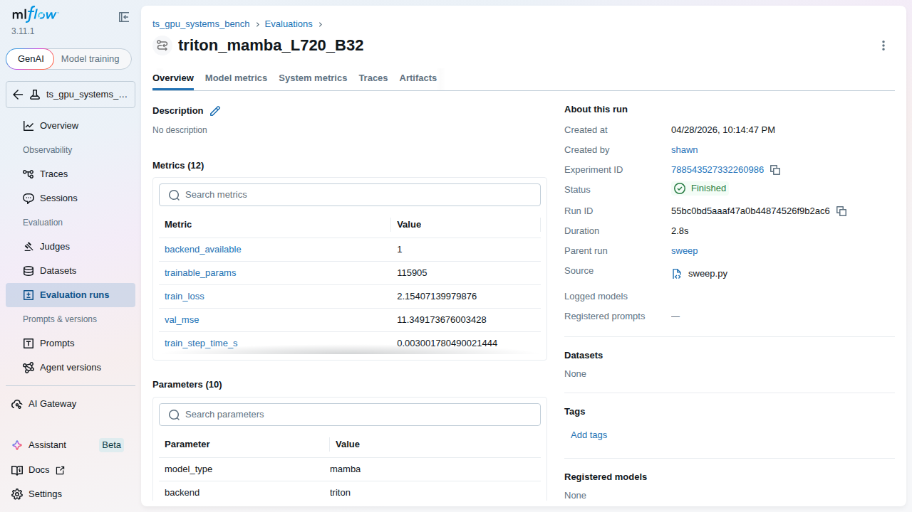

# ts-gpu-systems-bench

End-to-end benchmark for the claim:

> Faster causal rolling z-score preprocessing enables longer lookback windows, which improves ETTh1 forecasting metrics.

The project compares preprocessing backends (`pytorch_eager`, `compile`, `triton`, `tilelang`) and forecasting models (`mamba`, `transformer`) on ETTh1.

## What this repository includes

- ETTh1 data pipeline with canonical long-sequence split logic.
- Causal rolling z-score preprocessing with shared backend interface.
- Backends:
  - `pytorch_eager`: unfold + reduction baseline.
  - `compile`: `torch.compile`-wrapped baseline.
  - `triton`: fused Triton kernel with in-kernel online variance update.
  - `tilelang`: scaffolded backend hook (runtime-gated, falls back to reference path after availability check).
- Two forecasting models:
  - `MambaForecaster` (uses `mamba-ssm` when available, RNN fallback otherwise).
  - `FlashTransformerForecaster` (uses FlashAttention modules when available, `nn.MultiheadAttention` fallback otherwise).
- Hydra config composition, MLflow tracking, Optuna grid sweeps, and profiler trace export.

## Repo structure

- `src/data`: ETTh1 download/loading/splitting/window datasets.
- `src/preprocess`: backend registry and kernel implementations.
- `src/models`: Mamba and Transformer forecasters.
- `src/train`: training engine, profiler helper, and reusable training runner.
- `scripts`: CLI entrypoints for download, benchmarking, training, and sweep.
- `configs`: Hydra config groups.
- `tests`: unit-style checks for data pipeline, preprocessing, and model output shapes.
- `notebooks/analysis.ipynb`: MLflow run analysis and plotting.

## Environment setup

```bash
uv sync --all-extras --python 3.12
```

Use `pyproject.toml` + `uv.lock` as the source of truth. `requirements.txt` files are legacy convenience snapshots.

### System-level prerequisites

- NVIDIA driver with CUDA runtime support (this repo was validated on RTX 5080 + CUDA 13.x).
- CUDA toolkit with `nvcc` available (needed when `flash-attn` builds from source).
- Linux build toolchain (`gcc`, `g++`, `ninja`).

If `flash-attn` needs a source build:

```bash
CUDA_HOME=/usr/local/cuda MAX_JOBS=1 uv pip install --python .venv/bin/python flash-attn --no-build-isolation -v
```

### Distrobox note

Use an ML distrobox only if your host toolchain is mismatched or missing CUDA build dependencies. If your host already has working driver + CUDA toolkit + compiler toolchain, distrobox is optional.

### ONNX note

ONNX is not required for this benchmark. Add it only if you want export/deployment inference workflows.

Optional legacy installs:

```bash
uv add -r requirements.txt
uv add -r requirements-models.txt
uv add -r requirements-tilelang.txt
```

## Quick start

Download ETTh1:

```bash
python scripts/download_data.py
```

Run preprocessing benchmark:

```bash
python scripts/benchmark_preprocess.py preprocess=triton data.lookback=720 data.batch_size=32
```

Train one run:

```bash
python scripts/train.py preprocess=triton model=mamba data.lookback=1440 data.batch_size=16
```

Run medium Optuna/Hydra sweep (nested MLflow runs):

```bash
python scripts/sweep.py
```

## Latest Sweep Summary (2026-04-29 UTC)

This section summarizes the latest full sweep executed on `RTX 5080` in the `ml-box` distrobox container.

- Sweep parent run id: `a7de8f1cee76457fae42fad776e995a5`
- Trials: `24/24` finished
- Invalid/NA metrics: `0` for `val_mse`, `test_mse`, and `peak_mem_mb`
- Best run by `val_mse`: `triton + mamba + L720 + B32`
- Best run metrics:
  - `val_mse=11.3492`
  - `test_mse=42.1133`
  - `train_sps=10,660.3`
  - `test_sps=29,088.8`
  - `infer_ms/sample=0.0344`
  - `peak_mem_mb=261.3`

Artifacts:

- Full staff metrics table: `results/sweep_a7de8f1cee76457fae42fad776e995a5_staff_metrics.md`
- Top-10 table export: `results/sweep_a7de8f1cee76457fae42fad776e995a5_top10.md`
- Backend aggregate table export: `results/sweep_a7de8f1cee76457fae42fad776e995a5_backend_summary.md`

### Top 10 Configurations (tabulate)

| backend       | model       |   L |   B | val_mse     |   test_mse | train_step_s   | train_sps    | test_sps     | infer_ms/sample   | infer_ms/batch   |   peak_mem_mb | wall_s   |
|---------------|-------------|-----|-----|-------------|------------|----------------|--------------|--------------|-------------------|------------------|---------------|----------|
| triton        | mamba       | 720 |  32 | **11.3492** |    42.1133 | 0.003002       | 10,660.3     | 29,088.8     | 0.0344            | 1.0204           |         261.3 | 2.75     |
| tilelang      | mamba       | 720 |  16 | 15.5948     |    34.5924 | 0.003795       | 4,216.1      | 5,824.6      | 0.1717            | 2.6918           |         685.1 | 7.42     |
| pytorch_eager | transformer | 192 |  16 | 15.7595     |    66.9888 | 0.001627       | 9,833.1      | 35,667.2     | 0.0280            | 0.4344           |          80.1 | 3.11     |
| compile       | mamba       | 720 |  16 | 16.1496     |    33.5527 | 0.001780       | 8,988.4      | 12,345.3     | 0.0810            | 0.6248           |         139.9 | 3.49     |
| triton        | mamba       | 720 |  16 | 16.6052     |    38.482  | 0.001726       | 9,271.9      | 25,740.5     | 0.0388            | 0.5755           |         139.9 | 3.17     |
| tilelang      | mamba       | 192 |  32 | 17.7329     |    56.0813 | **0.001416**   | **22,605.8** | 60,255.0     | 0.0166            | 0.4908           |         114.1 | 1.53     |
| triton        | mamba       | 192 |  32 | 17.7527     |    54.862  | 0.001447       | 22,119.1     | **78,639.7** | **0.0127**        | **0.3774**       |          83.5 | **1.48** |
| tilelang      | mamba       | 336 |  32 | 18.7249     |    74.015  | 0.002484       | 12,882.1     | 22,148.7     | 0.0451            | 1.3821           |         309.9 | 2.59     |
| pytorch_eager | transformer |  96 |  32 | 21.3038     |    70.7354 | 0.001549       | 20,660.3     | 70,308.5     | 0.0142            | 0.4378           |          56.9 | 1.58     |
| triton        | transformer | 336 |  16 | 22.6521     |    46.135  | 0.001738       | 9,207.0      | 26,847.8     | 0.0372            | 0.5611           |         184.3 | 3.35     |

### Backend Aggregate (tabulate)

| backend       |   trials |   best_val_mse |   med_val_mse |   med_train_sps |   med_test_sps |   med_peak_mem_mb |   med_infer_ms_per_sample |   med_wall_time_s |
|---------------|----------|----------------|---------------|-----------------|----------------|-------------------|---------------------------|-------------------|
| triton        |        7 |        11.3492 |       22.6521 |          9207   |        25740.5 |             261.3 |                    0.0388 |              3.35 |
| tilelang      |        5 |        15.5948 |       18.7249 |         12882.1 |        22148.7 |             309.9 |                    0.0451 |              2.59 |
| pytorch_eager |        7 |        15.7595 |       29.2589 |          9833.1 |        22228.5 |             309.9 |                    0.045  |              3.11 |
| compile       |        5 |        16.1496 |       23.018  |          8988.4 |        12345.3 |             139.9 |                    0.081  |              4.32 |

### MLflow Screenshots



### Next steps

1. Implement the true TileLang fused rolling z-score kernel (replace placeholder path) and rerun the same sweep for a direct Triton vs TileLang kernel comparison.
2. Add explicit preprocessing metrics (`pre_latency_mean_ms`, `pre_eff_bw_gbps`, `pre_peak_mem_mb`) into the same sweep table for end-to-end kernel impact visibility.
3. Add inference percentile latency (`p50/p95`) and cold-start timing (compile + first batch) as first-class logged metrics.
4. Add automated plot generation from MLflow runs into `notebooks/analysis.ipynb` outputs for repeatable report exports.
5. Expand lookback schedules by model/backend-specific validity and VRAM probes to improve frontier mapping without manual retries.

## Key CLI override examples

```bash
# Compile backend, Transformer model
python scripts/train.py preprocess=compile model=transformer data.lookback=720

# TileLang path (skips gracefully if runtime unavailable)
python scripts/benchmark_preprocess.py preprocess=tilelang data.lookback=1440

# Force larger lookback and smaller batch
python scripts/train.py data.lookback=2880 data.batch_size=16 preprocess=triton model=mamba
```

## Metrics logged to MLflow

- Preprocessing benchmark:
  - `pre_latency_mean_ms`, `pre_latency_p50_ms`, `pre_latency_p95_ms`
  - `pre_peak_mem_mb`
  - `pre_eff_bw_gbps`
  - `pre_mae_vs_eager`, `pre_max_abs_vs_eager`
- Training:
  - `train_loss`, `val_mse`, `test_mse`
  - `train_step_time_s`, `val_step_time_s`
  - `train_samples_per_s`, `test_samples_per_s`
  - `peak_memory_mb`
  - `fit_in_vram`

Profiler traces are exported to `results/traces/` and logged as artifacts.

## TileLang status in this implementation

The TileLang backend is scaffolded with runtime availability checks and full benchmark/training wiring. The execution path is intentionally a reference implementation placeholder until the full fused TileLang kernel is integrated.

This keeps the experiment interface stable while allowing Triton/PyTorch backend execution immediately.

## Analysis notebook

Use `notebooks/analysis.ipynb` to:

- Load MLflow runs into a DataFrame.
- Plot validation MSE vs lookback by backend/model.
- Plot step-time scaling by lookback.
- Compute max fit lookback by backend/model from `fit_in_vram`.

## Validation notes

- Syntax/import validation:

```bash
python -m compileall src scripts tests
```

- Test suite:

```bash
uv run pytest
```

Passed: `7 passed`.
